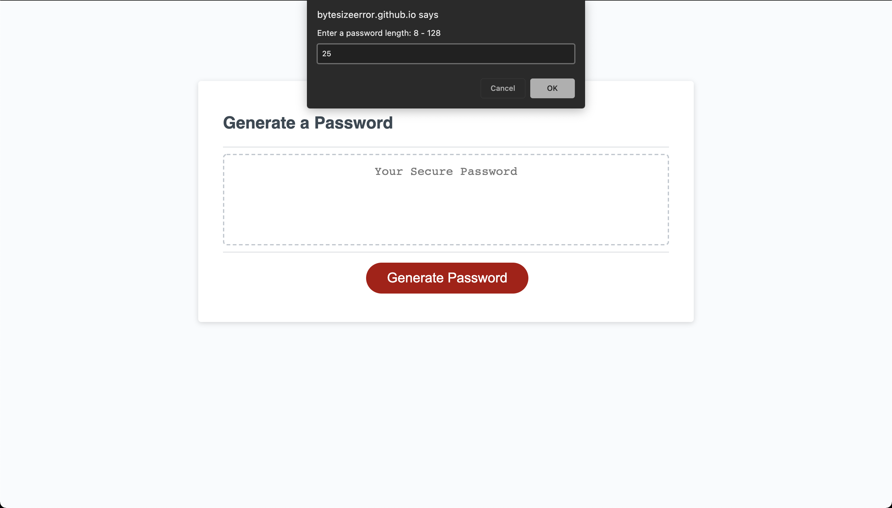
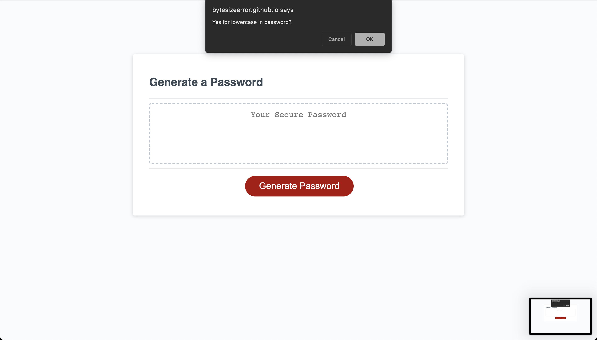
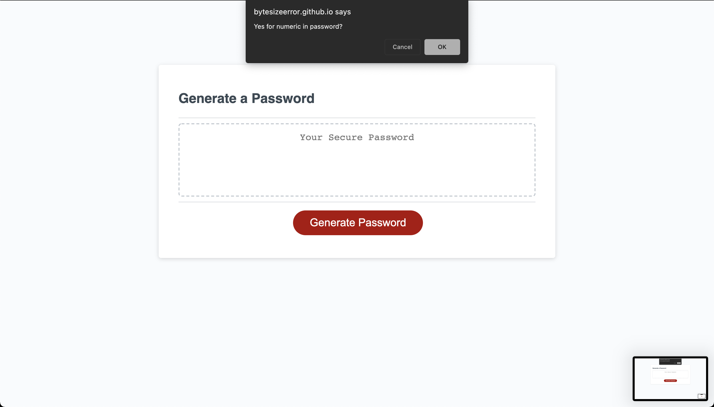
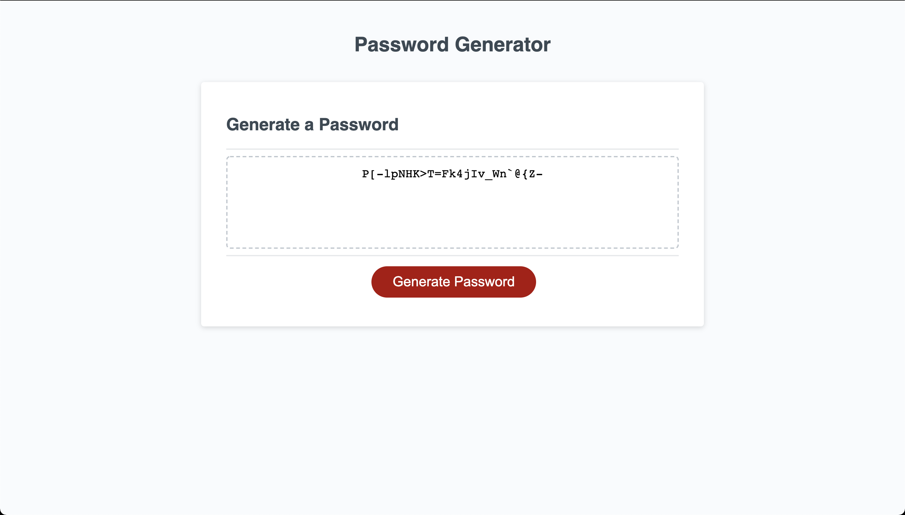

# Password-Generator

## Link to website
https://bytesizeerror.github.io/Password-Generator/

## Project Demo
* Prompts user to type in a password length from 8 - 128

* Prompts user if they want lowercase in their password

* Prompts user if they want uppercase in their password

* Prompts user if they want numbers in their password

* Prompts user if they want special characters in their password

* Password is generated

## Usage
To create secure passwords with selected criterias